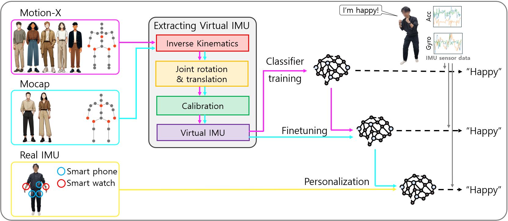
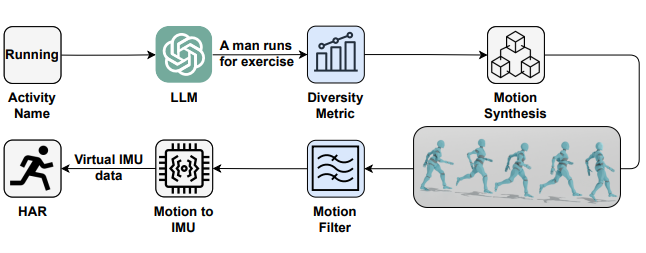
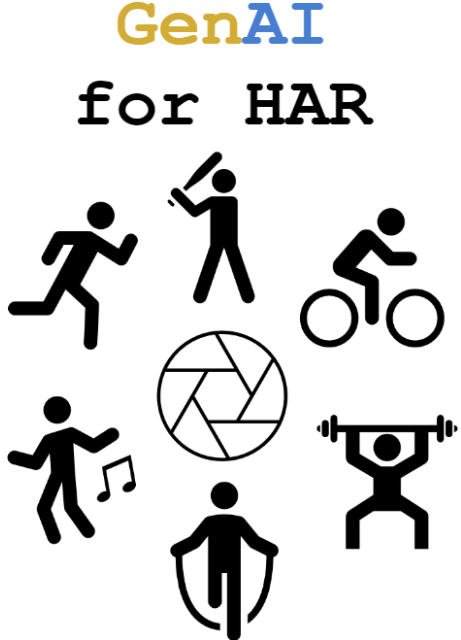
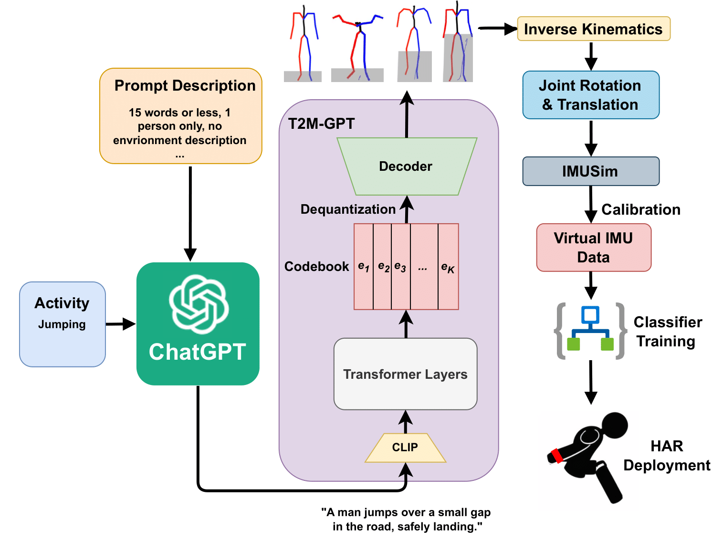
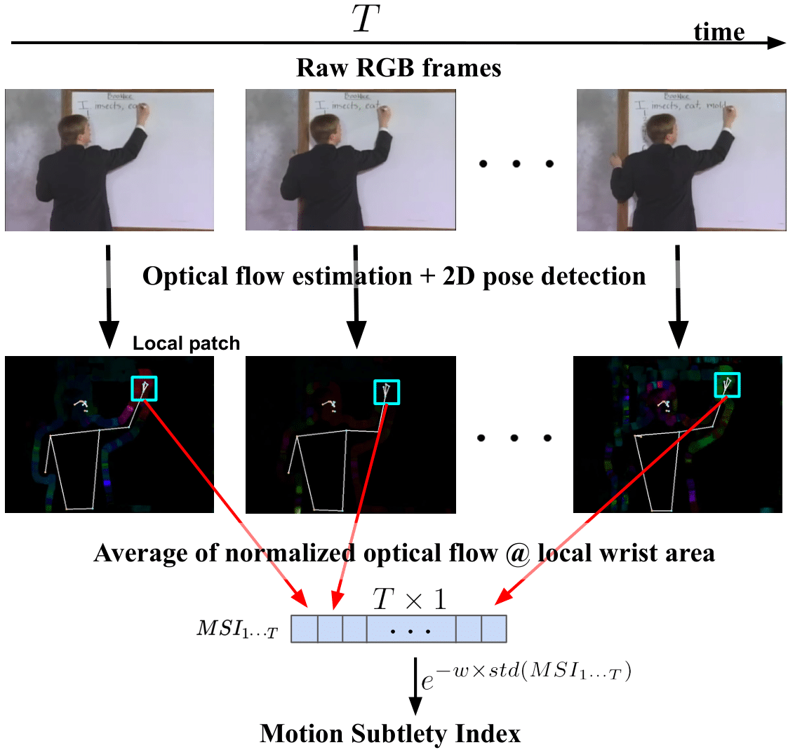

You can also find my articles on <u><a href="https://scholar.google.com/citations?user=P6qXmC8AAAAJ&hl=en">my Google Scholar profile</a>.</u>

  
  

      <b><a href="https://dl.acm.org/doi/abs/10.1145/3675095.3676617">More Data for People with Disabilities! Comparing Data Collection Efforts for Wheelchair Transportation Mode Detection</a></b>
        Sungjin Hwang*, <b>Zikang Leng*</b>, Seungwoo Oh, Kwanguk Kim, Thomas Plötz
        International Symposium on Wearable Computers (ISWC), 2024
  

  
  

      <b><a href="https://dl.acm.org/doi/abs/10.1145/3675094.3678452">Emotion Recognition on the Go: Utilizing Wearable IMUs for Personalized Emotion Recognition</a></b>
        <b>Zikang Leng*</b>, Myeongul Jung*, Sungjin Hwang, Seungwoo Oh, Lizhe Zhang, Thomas Plötz, Kwanguk Kim
        HASCA within UbiComp/ISWC 2024
  

  
  

      <b><a href="https://dl.acm.org/doi/10.1145/3678545">IMUGPT 2.0: Language-Based Cross Modality Transfer for Sensor-Based Human Activity Recognition</a></b>
        <b>Zikang Leng</b>, Amitrajit Bhattacharjee, Hrudhai Rajasekhar, Lizhe Zhang, Elizabeth Bruda， Hyeokhyen Kwon, Thomas Plötz
        IMWUT.
  

  
  

      <b><a href="https://dl.acm.org/doi/10.1145/3597638.3614491">FingerSpeller: Camera-Free Text Entry Using Smart Rings for American Sign Language Fingerspelling Recognition</a></b>
        David Martin*, <b>Zikang Leng*</b>, Tan Gemicioglu, Jon Womack, Jocelyn Heath, William C Neubauer, Hyeokhyen Kwon, Thomas Plötz, Thad Starner.
        ASSETS, 2023.
  

  
  

      <b><a href="https://arxiv.org/abs/2310.12085">On the Benefit of Generative Foundation Models for Human Activity Recognition</a></b>
        <b>Zikang Leng</b>, Hyeokhyen Kwon, Thomas Plötz
        Generative AI for Pervasive Computing (GenAI4PC) Symposium within UbiComp/ISWC, 2023.
  

  
  

      <b><a href="https://dl.acm.org/doi/10.1145/3594738.3611361">Generating Virtual On-body Accelerometer Data from Virtual Textual Descriptions for Human Activity Recognition</a></b>
        <b>Zikang Leng</b>, Hyeokhyen Kwon, Thomas Plötz
        International Symposium on Wearable Computers (ISWC), 2023.
        🏆 Best Paper Honorable Mention 
  

  
  

      <b><a href="https://dl.acm.org/doi/10.1145/3594738.3611364">On the Utility of Virtual On-body Acceleration Data for Fine-grained Human Activity Recognition</a></b>
        <b>Zikang Leng</b>, Yash Jain, Hyeokhyen Kwon, Thomas Plötz
        International Symposium on Wearable Computers (ISWC), 2023.
  

